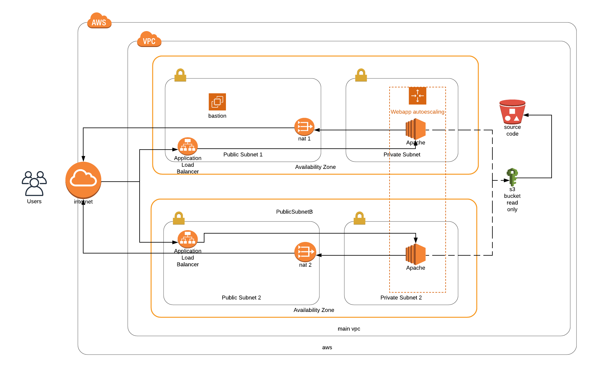

# Deploy a High-Availability Web App using CloudFormation

## Working app:

Amazon url: http://udagr-MainA-WWIDL6MYOPAW-473382253.us-west-2.elb.amazonaws.com

I connected the url with an easier to read domain using a CNAME record: http://udagram.generico.icu/

## Diagram

I tried to make the diagram a high level representation of the requirements.
That's why I didn't add certain elements liek the routing tables. I feel that those
are more part of the concrete solution.

## Code.

In the classes the `.yml` are called "scripts" but in the amazon docs are called "templates".
Also, in the docs when they mention a "script" is usually something that gets executed.

To avoid confusion I created 2 folders: `templates` (with the yaml templates) and `actions`
(with a bunch of useful sh scripts).

Also, there is a config.sh file. The idea of this file is set the most important
variabled needed to run the actions.

The `update-*` and `create-*` are kind of redundant with the `deploy-*` scripts.
I a little bit more confortable just using the deploy ones, but leaved the update
and create ones to match what we did in the classes.

## Content

I just found more fun to deploy a beutiful static site instead
of a string. It also justifies better to use s3 on the deployment,
so I found a free template online and I used it. Still, I saw at
the end that there was a requirement about a precise string.
If there is some kind of automatic test for that response
on the server I'm happy to make the change :)

## Special thanks

The **Colorlib** team. They made amazing free templates that can be
used for static websites.